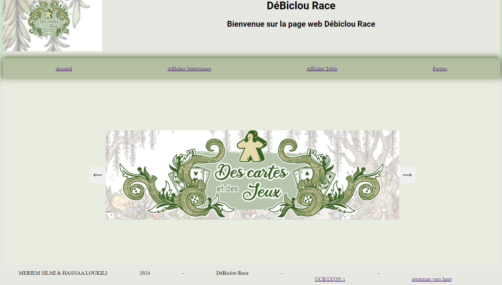
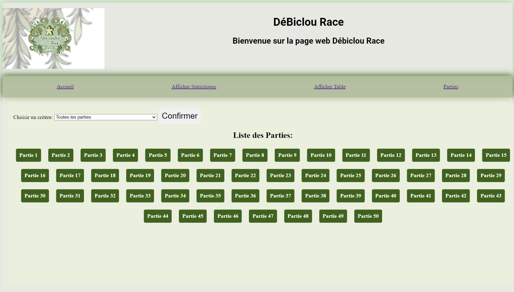
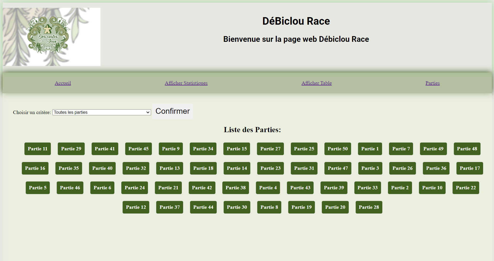
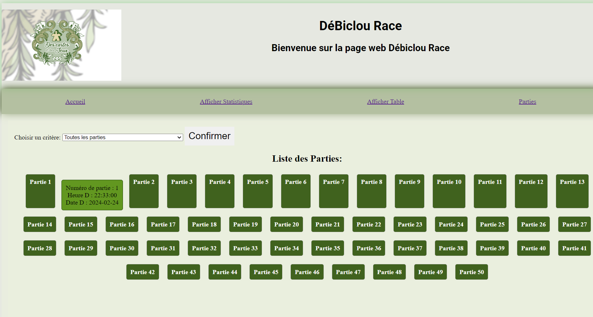

# 🃏 Debilou Race Web Application


> A web-based card game application built with PHP, MVC architecture, and SQL persistence.

---

## Table of Contents

- [Overview](#overview)
- [Features](#features)
- [Project Structure](#project-structure)
- [Technologies](#technologies)
- [Build & Run](#build--run)
- [Screenshots](#Screenshots)

---

## Overview

This project implements **Debilou Race** as a web application built with PHP.

It follows a **Model-View-Controller (MVC)** architecture to clearly separate business logic, presentation, and request handling:

- **Models** manage data and game logic
- **Views** handle the user interface
- **Controllers** process actions and coordinate the application flow

The project also integrates SQL scripts for data storage and uses CSS for the visual interface.

---

## Features

- Card game logic and rule management
- Web-based player interaction
- MVC project organization
- SQL database integration
- Dynamic pages with PHP
- Styled interface with CSS
- Project documentation and installation files included

---


## Project Structure

```
card-game-java/
├── card-game-java/
│   ├── controleurs/        # Application controllers
│   ├── css/                # Stylesheets
│   ├── img/                # Images and visual assets
│   ├── inc/                # Includes and configuration files
│   ├── modele/             # Data models and database logic
│   ├── static/             # Shared layout components
│   ├── vues/               # Application views
│   ├── index.php           # Entry point
│   ├── acceuil.png         # Interface preview
│   ├── partie.png          # Interface preview
│   ├── partie2.png         # Interface preview
│   └── partie3.png         # Interface preview
├── INSTALL.txt             # Installation instructions
├── Rapport.pdf             # Project report
├── SCHEMA.pdf              # Database schema documentation
├── basedonée.sql           # Database script
├── importation.sql         # Import script
├── requete.sql             # SQL queries
├── mode_Relationnel.pdf    # Relational model documentation
└── README.md
```

---

## Technologies

| Technology | Role |
|------------|------|
| PHP | Backend development |
| MVC | Application architecture |
| SQL | Database structure and persistence |
| HTML/CSS | User interface and styling |
| Apache / Local server | Local execution environment |

---

## Build & Run

### Prerequisites

- A local PHP server environment (XAMPP, MAMP, WAMP, or equivalent)
- MySQL / MariaDB
- A web browser

### Setup

1. Clone the repository:
```bash
git clone https://github.com/anastasia638/card-game-java.git
```
---

## Skills Demonstrated

- **PHP** web development
- **MVC** architecture
- **SQL** database design and queries
- Frontend integration with **HTML/CSS**
- Application structuring and modularity
- Documentation and project organization

---
## Screenshots

### Home


### Game 1


### Game 2


### Game 3


## Author

**Meriem Silmi** — Computer Science Student, France

[](https://github.com/anastasia638)
